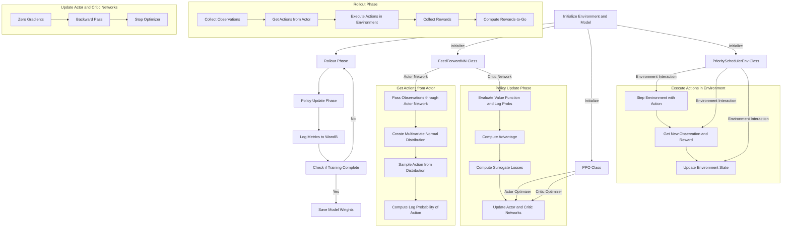

# CPU-SCHEDULING

Training Deep-RL-Model to optimize the turnaround time for cpu scheduling algorithm outperforming Round-Robin.
the model learns to prioritize tasks effectively reducing the turnaround time

## SYSTEM DESIGN

