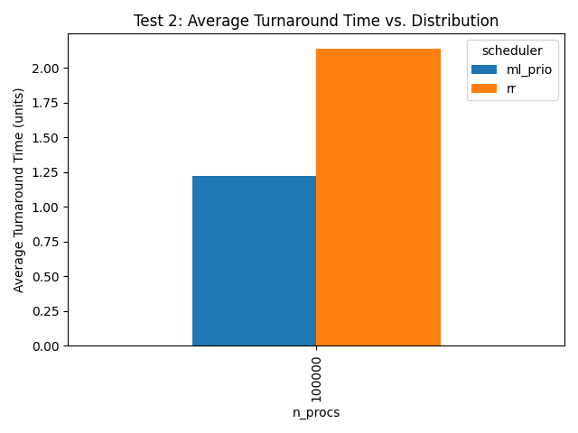
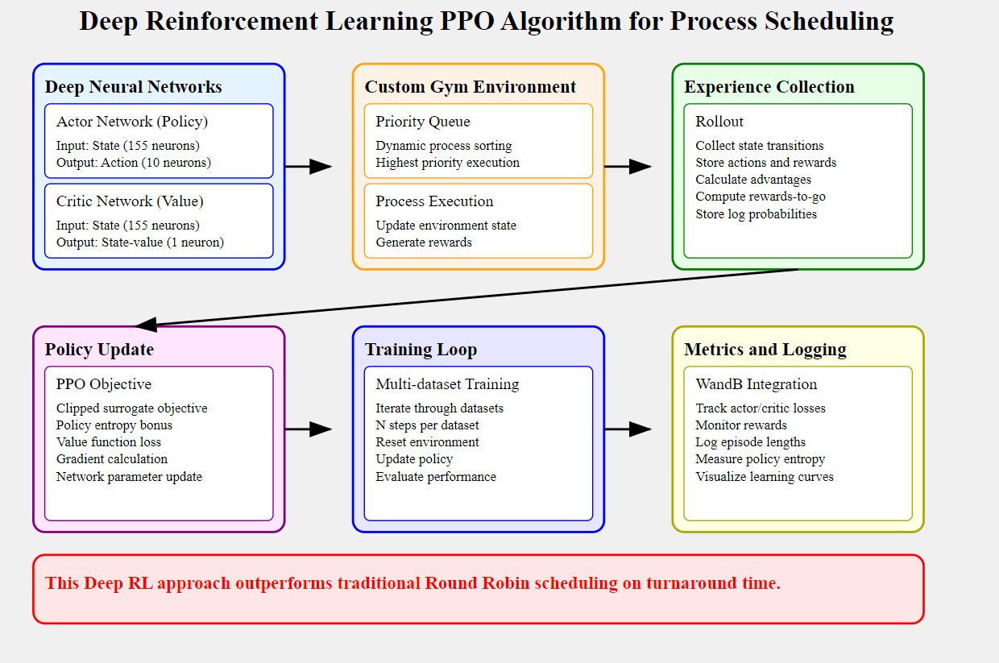
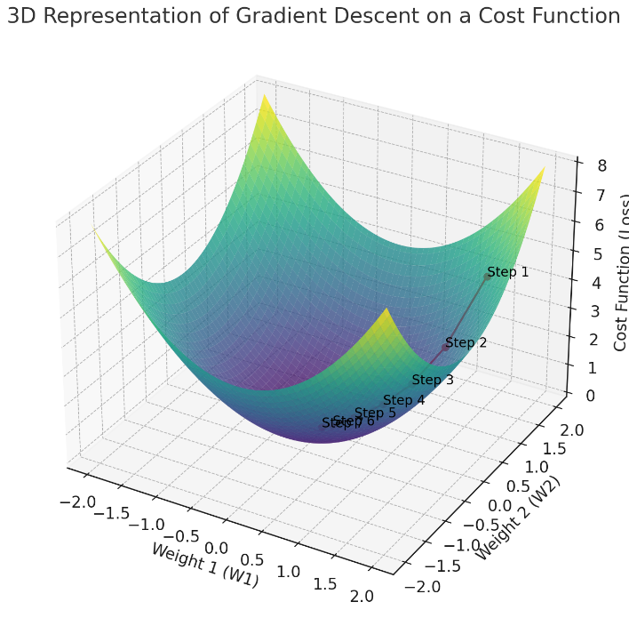

# CPU-SCHEDULING

Training Deep-RL-Model to optimize the turnaround time for cpu scheduling algorithm outperforming Round-Robin.
The model employs proximal policy optimization and understands complex relationships in the dataset and learns to prioritise task to optimise for turnaround time

## SYSTEM DESIGN

Hii, I am a machine learning engineer. I have worked on innovative projects such as a production-ready RAG application that bridges private data with LLMs and on-device speaker diarization for mobile. I am a consultant helping companies operationalize Large Language Models (LLMs) to accelerate their AI product journey.

## Gradient Descent

