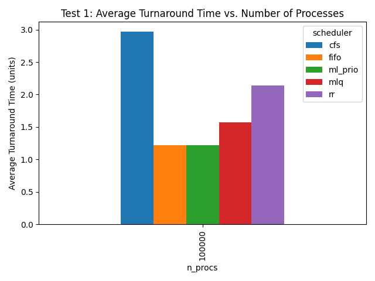

# CPU-SCHEDULING

Training Deep-RL-Model to optimize the turnaround time for cpu scheduling algorithm outperforming Round-Robin.
The model employs proximal policy optimization and understands complex relationships in the dataset and learns to prioritise task to optimise for turnaround time

## SYSTEM DESIGN

## Gradient Descent

